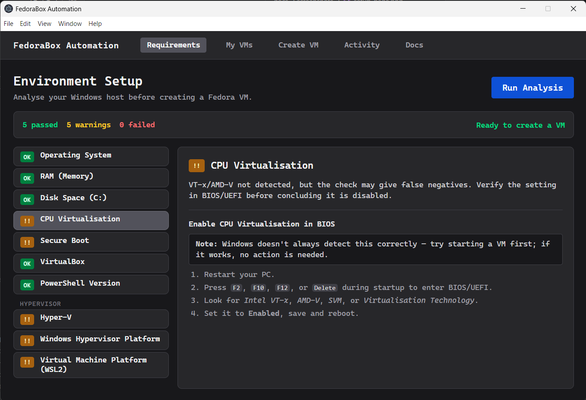
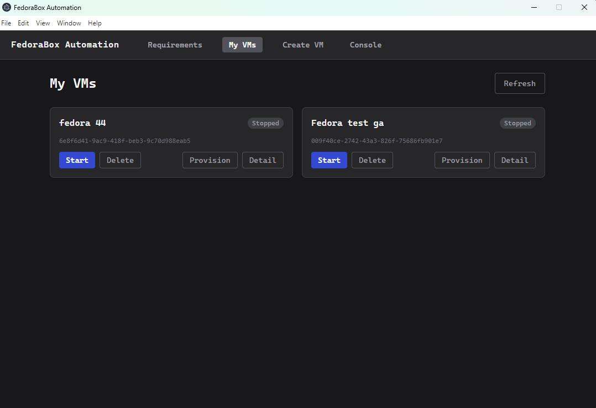
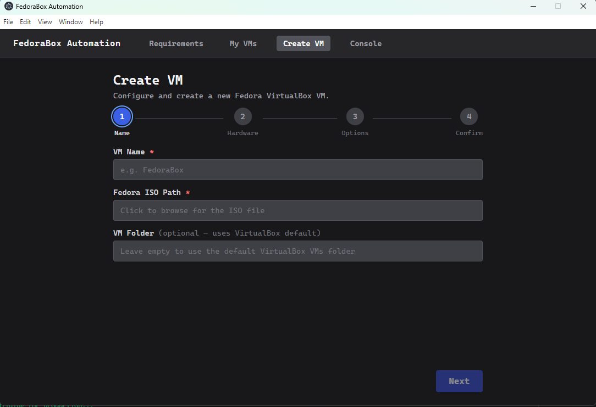
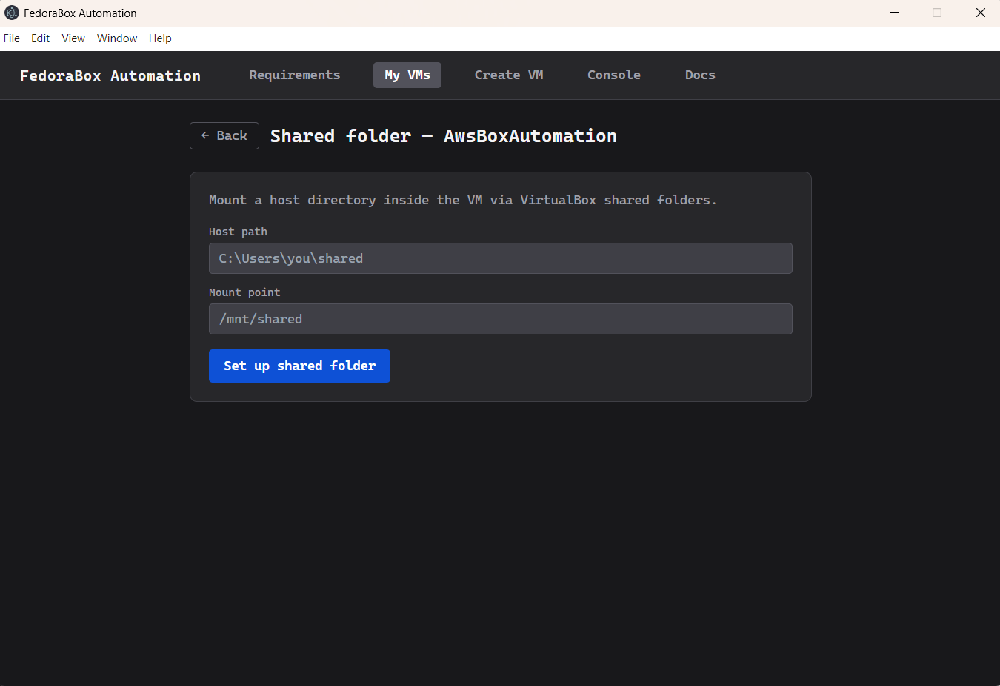
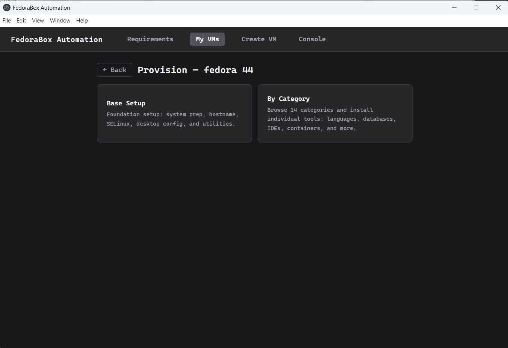
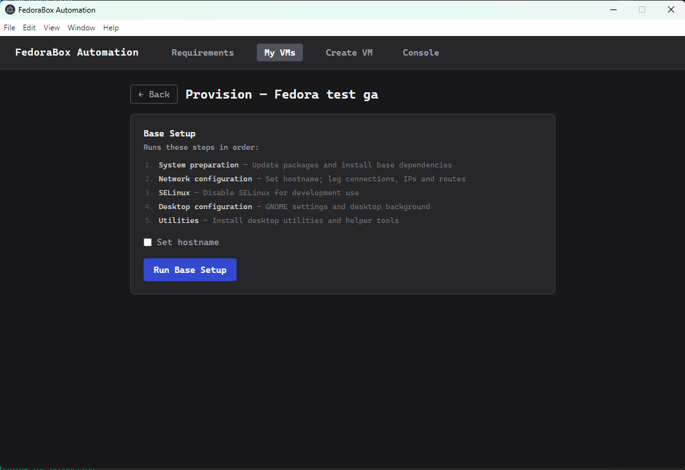

= FedoraBox Automation
:toc: left
:toc-title: Contents
:toclevels: 2
:icons: font
:source-highlighter: highlight.js

A PowerShell toolkit and Electron GUI for creating and provisioning Fedora Linux VMs in VirtualBox on Windows 11 Home.

image:https://img.shields.io/badge/platform-Windows%2011%20Home-blue[Platform]
image:https://img.shields.io/badge/PowerShell-5.1%2B-blue[PowerShell]
image:https://img.shields.io/badge/Node.js-18%2B-green[Node.js]
image:https://img.shields.io/badge/license-MIT-green[License]

== Features

* *Environment analysis* — checks RAM, disk, CPU virtualisation, Hyper-V, and VirtualBox version with one click; surfaces fix instructions for every failing check
* *Silent VirtualBox install* — downloads and installs VirtualBox without prompts
* *Guided VM creation* — 4-step wizard (name → hardware → options → confirm) with a native ISO file picker
* *One-click provisioning* — installs Java, Docker, Python, Tomcat, PostgreSQL, and more via VirtualBox Guest Control
* *Live log streaming* — PowerShell output streams line-by-line into the GUI as each script runs
* *Shared folders and log export* — mounts host directories inside the VM; exports VM logs back to the host
* *Full test coverage* — Pester v5 (PowerShell), bats-core (Bash), Vitest + React Testing Library (GUI)

== Screenshots

.Setup — environment analysis with fix instructions

.My VMs — VM list with start / stop / delete controls

.Create VM — 4-step wizard

.Shared folder — VM readiness banner and mount configuration

.Provision — credentials and entry point (Base Setup / By Category)

.Provision — Base Setup detail with hostname option

.Provision — By Category grid (14 categories)
image::docs/screenshots/provision-by-category.png[Provision by category, width=800]

.Provision — category drill-down (Databases example)
image::docs/screenshots/provision-detail.png[Provision detail, width=800]

== Requirements

[cols="1,2",options="header"]
|===
| Requirement | Minimum

| OS | Windows 11 Home (64-bit)
| RAM | 8 GB total (4 GB minimum)
| Free disk | 30 GB on C:
| CPU | Intel VT-x or AMD-V enabled in BIOS
| Hyper-V | Must be *disabled*
| PowerShell | 5.1+ (included in Windows 11)
| Node.js | 18+ (GUI only)
|===

NOTE: VirtualBox and Hyper-V both require exclusive access to the CPU's virtualisation hardware. Running both simultaneously causes VM start failures.

== Quick Start

=== Option A — Electron GUI (recommended)

[source,powershell]
----
cd FedoraBoxAutomation/app
npm install        # first time only; repeat after git pull if package.json changed
npm run dev        # opens the desktop app
----

. Click *Setup* → *Run Analysis* to check your host
. Click *Create VM* and follow the 4-step wizard
. After creating the VM, open *My VMs* and click the VM name to access provisioning and shared folder options

=== Option B — PowerShell scripts

[source,powershell]
----
cd FedoraBoxAutomation

# 1. Check prerequisites
powershell -ExecutionPolicy Bypass -File ".\host\virtualbox-sanity-checks.ps1"

# 2. Install VirtualBox
powershell -ExecutionPolicy Bypass -File ".\host\virtualbox-install.ps1"

# 3. Create a Fedora VM
powershell -ExecutionPolicy Bypass -File ".\host\create-vm.ps1"

# 4. Run base OS setup inside the VM (system-prep, network, SELinux, desktop, utilities)
powershell -ExecutionPolicy Bypass -File ".\host\provision-setup.ps1" -VmName "FedoraBox" -VmUser root -VmPass <password> -LoginUser <username> -NonInteractive

# 5. Install a single tool inside the VM (e.g. Docker)
powershell -ExecutionPolicy Bypass -File ".\host\provision-script.ps1" -VmName "FedoraBox" -VmUser root -VmPass <password> -LoginUser <username> -ScriptRelPath "tools/containers/docker.sh" -NonInteractive
----

== GUI Overview

The desktop app is built with Electron + React and runs at a fixed 1100×750 window.

[cols="1,3",options="header"]
|===
| Page | Description

| *My VMs*
| Lists all registered VirtualBox VMs with Start / Stop / Delete controls; click a VM name to open its detail page

| *VM detail — Provision*
| Test Connection verifies guestcontrol credentials; choose Base Setup (system-prep, hostname, SELinux, desktop, utilities) or install individual tools by category; success / failure / already-installed / force-install banners after each run

| *VM detail — Share Folder*
| Mount a host directory inside the VM; VM readiness banner checks running state and Guest Additions

| *Setup*
| Runs the environment analysis; left panel lists all checks, right panel shows detail and fix instructions for the selected check; first failing check is auto-selected

| *Create VM*
| 4-step wizard — Identity → Hardware → Options → Confirm; ISO field opens a native file picker; streams live output during creation

| *Console*
| Views the last 500 lines of `gui.log` (IPC calls) and `host.log` (PowerShell transcript); auto-scrolls to newest entry; folder shortcuts open log directories in Explorer

| *Docs*
| Renders the project markdown docs inside the app (dev mode only)
|===

NOTE: Setup and Create VM stay mounted in the background so analysis results and wizard progress survive navigation.

== Script Pipeline

[source]
----
host/common.ps1                  shared helpers: Find-VBoxManage, Invoke-VBox, credential store
host/virtualbox-sanity-checks.ps1   checks RAM, disk, CPU virt, Hyper-V, VirtualBox version
host/virtualbox-install.ps1         downloads and silently installs VirtualBox
host/create-vm.ps1                  creates a Fedora 64-bit VM from ISO
host/provision-setup.ps1            runs all base OS setup scripts (system-prep, network, SELinux, desktop, utilities)
host/provision-script.ps1           uploads and runs a single guest Bash script via Guest Control
host/share-folder.ps1               mounts a host directory inside the VM as a shared folder
host/share-logs.ps1                 exports VM logs to the host via a shared folder
----

=== Guest Additions

Provisioning requires Guest Additions installed inside the VM.
`create-vm.ps1` offers to attach the ISO automatically.
After Fedora OS installation completes:

[source,bash]
----
# Inside the VM
sudo dnf update -y
sudo dnf install -y dkms kernel-devel-$(uname -r) kernel-headers gcc make perl bzip2
sudo sed -i 's/^SELINUX=.*/SELINUX=disabled/' /etc/selinux/config
sudo reboot

# After reboot
sudo mkdir -p /mnt/ga
sudo mount /dev/sr1 /mnt/ga   # use lsblk to confirm the device
sudo /mnt/ga/VBoxLinuxAdditions.run
sudo passwd root               # required for Guest Control authentication
sudo reboot
----

IMPORTANT: Always authenticate as `root`, not a regular user. `sudo` requires a TTY which Guest Control does not provide.

== Project Structure

[source]
----
FedoraBoxAutomation/
├── host/                     PowerShell scripts (run on Windows)
│   ├── common.ps1
│   ├── virtualbox-sanity-checks.ps1
│   ├── virtualbox-install.ps1
│   ├── create-vm.ps1
│   ├── provision-setup.ps1
│   ├── provision-script.ps1
│   ├── share-folder.ps1
│   └── share-logs.ps1
│
├── vm/                       Bash scripts (run inside the Fedora VM)
│   ├── lib/common.sh         shared logging and error helpers
│   ├── setup/                OS configuration (SELinux, desktop, network)
│   └── tools/                dev tool installers
│       ├── languages/        Java, Python, PHP
│       ├── build-tools/      Maven
│       ├── web-servers/      Apache, Tomcat
│       ├── databases/        MariaDB, PostgreSQL, DBeaver
│       ├── containers/       Docker, minikube, kubectl
│       ├── cloud/            AWS CLI, ECS CLI
│       └── ides/             Eclipse, VS Code
│
├── app/                      Electron + React desktop GUI
│   ├── electron/             Node.js main process
│   │   ├── main.js
│   │   ├── ipc-handlers.js
│   │   ├── script-runner.js
│   │   └── preload.js
│   └── src/                  React renderer
│       ├── pages/
│       └── components/
│
└── docs/
    ├── ELECTRON-GUI-DESIGN.md
    ├── DEVELOPMENT.md
    └── TESTING.md
----

== Running the Tests

Full setup and usage instructions are in link:FedoraBoxAutomation/docs/TESTING.md[docs/TESTING.md].

[cols="2,3,2",options="header"]
|===
| Suite | Command | Where

| PowerShell — Pester v5
| `Invoke-Pester -Path ".\host\" -Output Detailed`
| Windows PowerShell

| Bash — bats-core
| `sudo bats vm/tests/`
| Linux / WSL

| React + Electron — Vitest
| `cd app && npm test`
| Windows or Linux (Node.js)
|===

Current totals: *407 Vitest tests* across 16 files.

== Troubleshooting

*VBoxManage not found* +
Run `virtualbox-install.ps1` or add `C:\Program Files\Oracle\VirtualBox` to your system PATH.

*Guest Control fails / credentials rejected* +
Use `root` as the username. If Guest Additions were installed before a kernel update, reinstall them:

[source,bash]
----
sudo dnf install -y kernel-devel-$(uname -r)
sudo /mnt/ga/VBoxLinuxAdditions.run
sudo reboot
----

*Script hangs during provisioning* +
All `dnf` commands must include `-y`. Any interactive prompt hangs indefinitely because Guest Control has no TTY.

*Hyper-V conflict* +
[source,powershell]
----
Disable-WindowsOptionalFeature -Online -FeatureName Microsoft-Hyper-V-All
----

*Low VM resolution* +
Set Video RAM to at least 128 MB and install Guest Additions.

== Contributing

See link:FedoraBoxAutomation/CONTRIBUTING.md[CONTRIBUTING.md] for coding standards covering PowerShell scripts, Bash scripts, and guest control patterns.

== License

MIT
