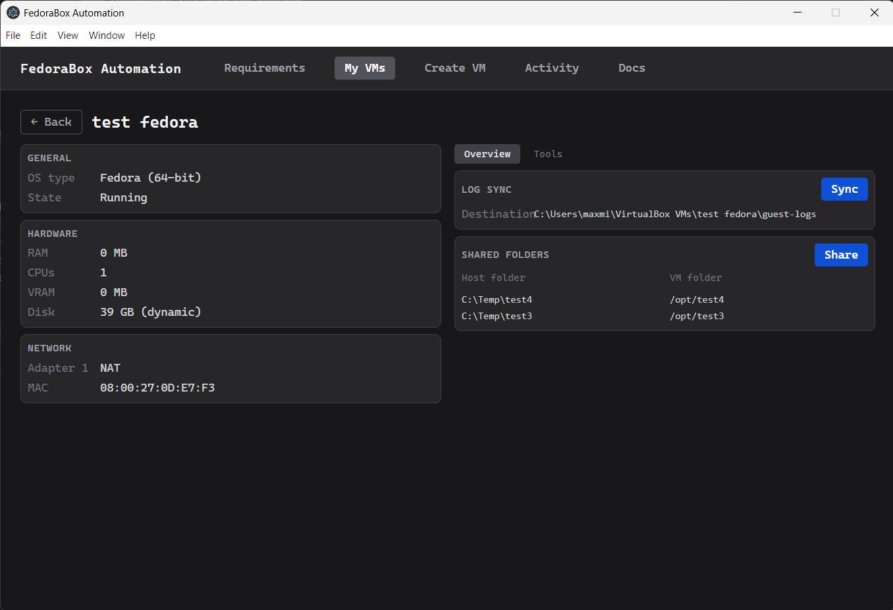
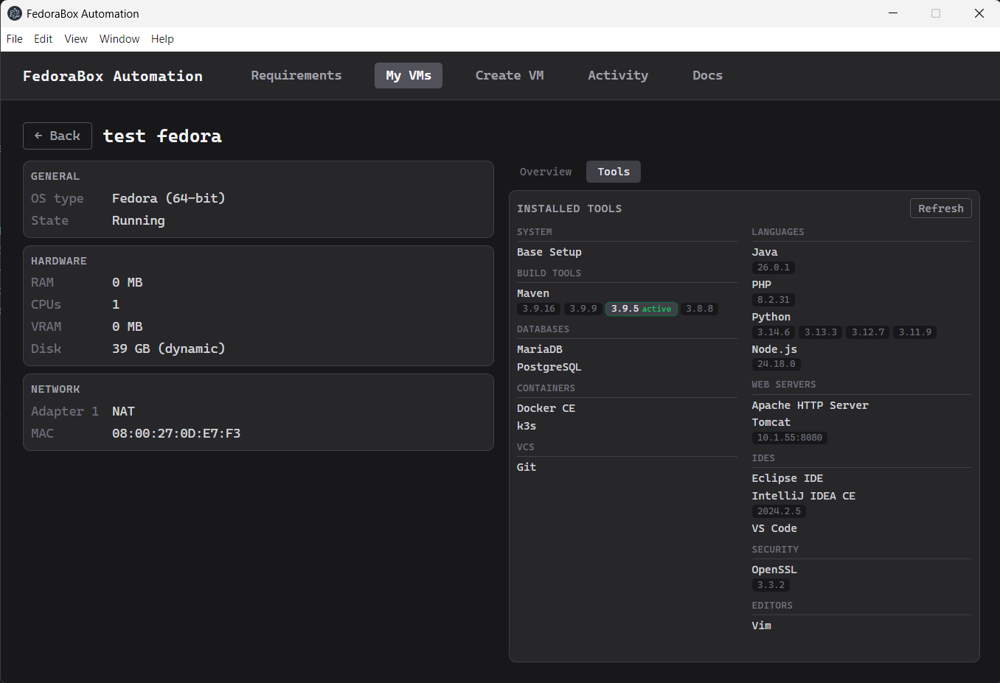
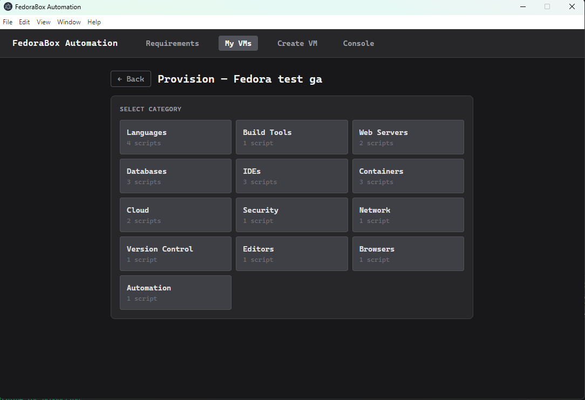
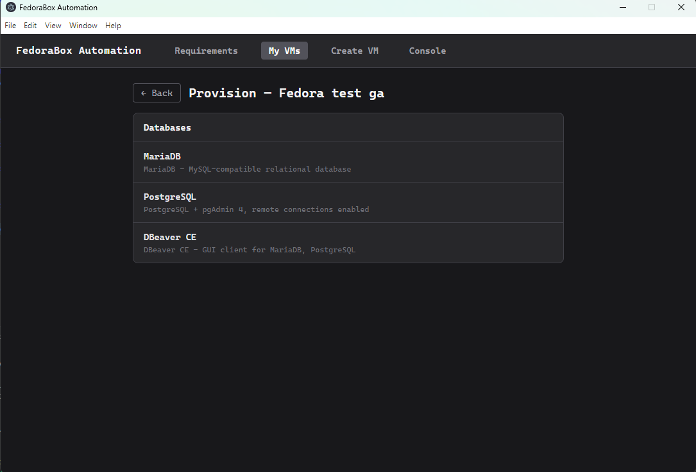
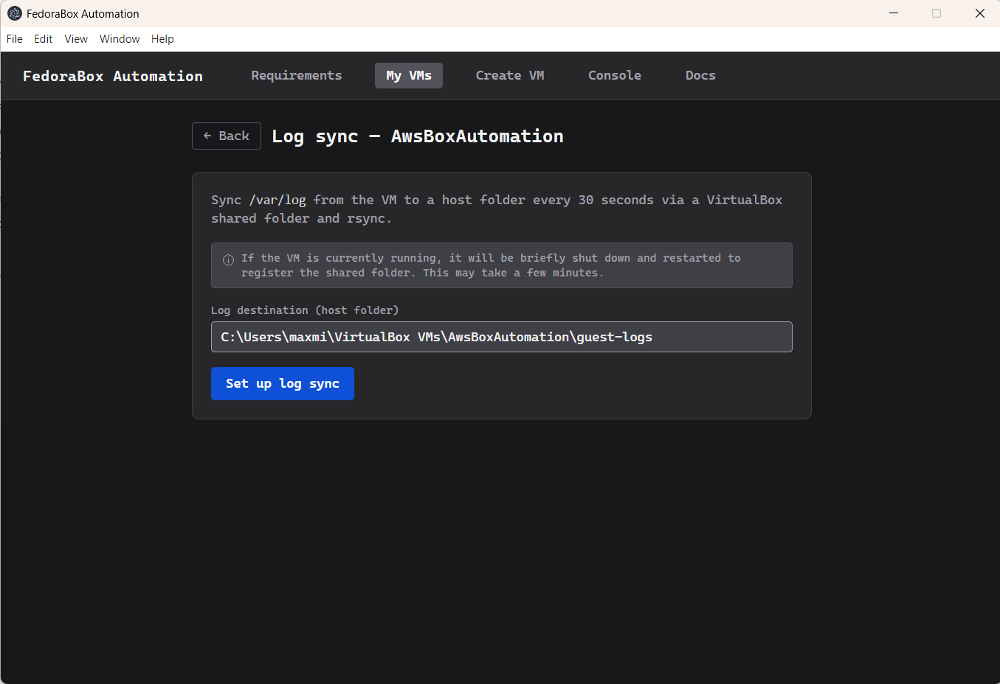

# FedoraBox Automation

A PowerShell automation toolkit for creating and provisioning Fedora Linux VMs in VirtualBox on Windows 11 Home, with an Electron + React GUI to orchestrate the pipeline.

## Features

- **Requirements check** — validates RAM, disk space, CPU virtualisation, Hyper-V, and VirtualBox version before you start
- **VM creation wizard** — configures and creates a Fedora VM from ISO with a step-by-step form
- **One-click provisioning** — installs languages (Java, Python, PHP, Node.js), build tools, databases, web servers, IDEs, containers, and more via guest control
- **Installed tools view** — detects what is installed in a running VM and shows versions at a glance
- **Shared folders** — mounts host directories inside the VM
- **Log sync** — copies guest logs to a host folder for easy inspection

## Requirements

- Windows 11 Home (Hyper-V must be disabled)
- VirtualBox 7.x
- At least 8 GB RAM and 30 GB free disk on the host
- CPU virtualisation enabled in BIOS

## Quick start

```powershell
# 1. Validate the host environment
powershell -ExecutionPolicy Bypass -File ".\host\virtualbox-sanity-checks.ps1"

# 2. Install VirtualBox (if not already installed)
powershell -ExecutionPolicy Bypass -File ".\host\virtualbox-install.ps1"

# 3. Create a Fedora VM
powershell -ExecutionPolicy Bypass -File ".\host\create-vm.ps1"

# 4. Launch the GUI
cd app && npm install && npm run dev
```

## Screenshots

### Requirements


### Create VM


### My VMs


### VM Detail — Overview



### VM Detail — Installed Tools



### Provision






### Share Folder


### Log Sync



## Documentation

- [Development guide](docs/DEVELOPMENT.md)
- [GUI design](docs/ELECTRON-GUI-DESIGN.md)
- [Post-install notes](docs/POST-INSTALL.md)
- [Testing](docs/TESTING.md)
- [Contributing](CONTRIBUTING.md)
